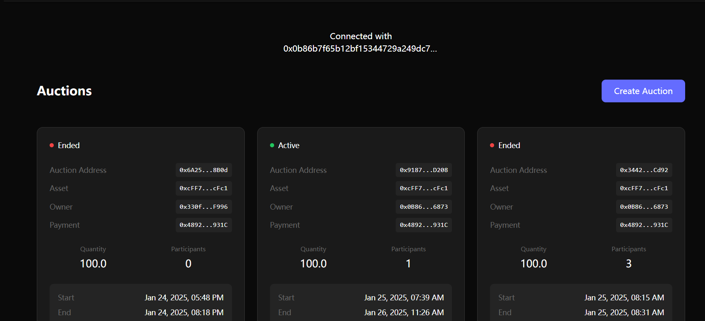
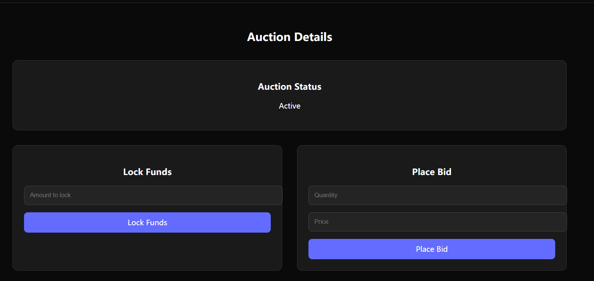
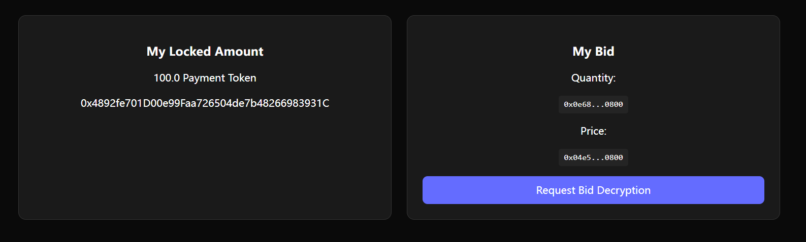
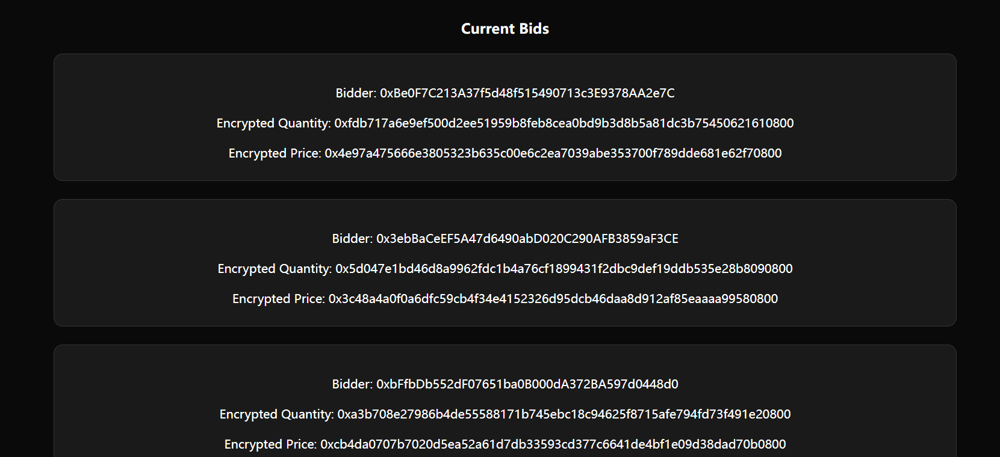
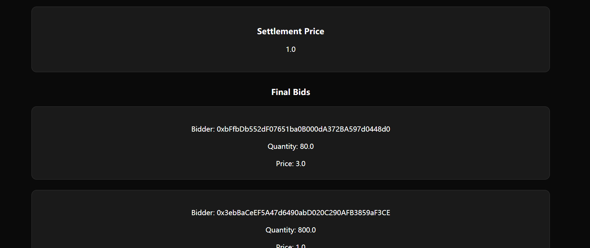

# Confidential Single-Price Auction Frontend - ShadowBid

A React-based decentralized application (dApp) demonstrating private auctions using Fully Homomorphic Encryption (FHE) on the FHEVM blockchain.

## Overview

This project showcases how to build privacy-preserving auctions where bids remain encrypted until the auction ends. Built with fhevmjs, React, and Vite, it demonstrates:

- Creating and managing private auctions
- Placing encrypted bids
- Locking funds for auction participation
- Settling auctions and revealing bids
- Supporting both ETH and ERC20 tokens for payments

## Features

- **Auction Creation**: Create auctions with customizable parameters
- **Encrypted Bidding**: Place bids that remain private until auction completion
- **Fund Management**: Lock and manage funds for auction participation
- **Multi-Token Support**: Use ETH or ERC20 tokens for payments
- **Real-time Status**: Track auction status, participants, and timing
- **Bid Decryption**: Secure process for revealing bids after auction ends

## Prerequisites

- Node.js
- npm or yarn
- MetaMask or another Web3 wallet
- Testnet ETH (for Sepolia network)

## Installation

1. Clone the repository:

```bash
git clone https://github.com/your-username/fhevmjs-react-template
cd fhevmjs-react-template
```

2. Install dependencies:

```bash
npm install
```

## Configuration

1. Copy the environment template:

```bash
cp .env.example .env
```

2. Update the `.env` file with your configuration:

```
VITE_GATEWAY_URL=your_gateway_url
VITE_ACL_ADDRESS=your_acl_address
VITE_KMS_ADDRESS=your_kms_address
VITE_AUCTION_FACTORY_CONTRACT_ADDRESS=your_auction_factory_address
```

## Development

Start the development server:

```bash
npm run dev
```

The application will be available at [http://localhost:5173/](http://localhost:5173/)

## Testing

### Using Sepolia Testnet

For testing with the actual FHEVM:

1. Configure your `.env` for Sepolia
2. Ensure you have Sepolia testnet ETH
3. Connect your wallet to Sepolia network

## Key Components

- **AuctionDetails**: Manages individual auction interactions
- **Auctions**: Displays auction listings and creation
- **AuctionCard**: Renders auction information cards
- **AuctionModal**: Handles auction creation interface

## Building for Production

```bash
npm run build
```

## Resources

- [fhevmjs Documentation](https://docs.zama.ai/fhevm)
- [Zama Documentation](https://docs.zama.ai)
- [React Documentation](https://reactjs.org/)
- [Vite Documentation](https://vitejs.dev/)

## Screenshots

- List of auctions page



- Auction details page / lock funds or place bid



- Auction details page / locked funds and my bids



- Auction details page / encrypted bids



- Auction details page / decrypted bids



## Contributing

Contributions are welcome! Please feel free to submit a Pull Request.

## License

This project is licensed under the GPL-3.0 License. See the LICENSE file for details.
